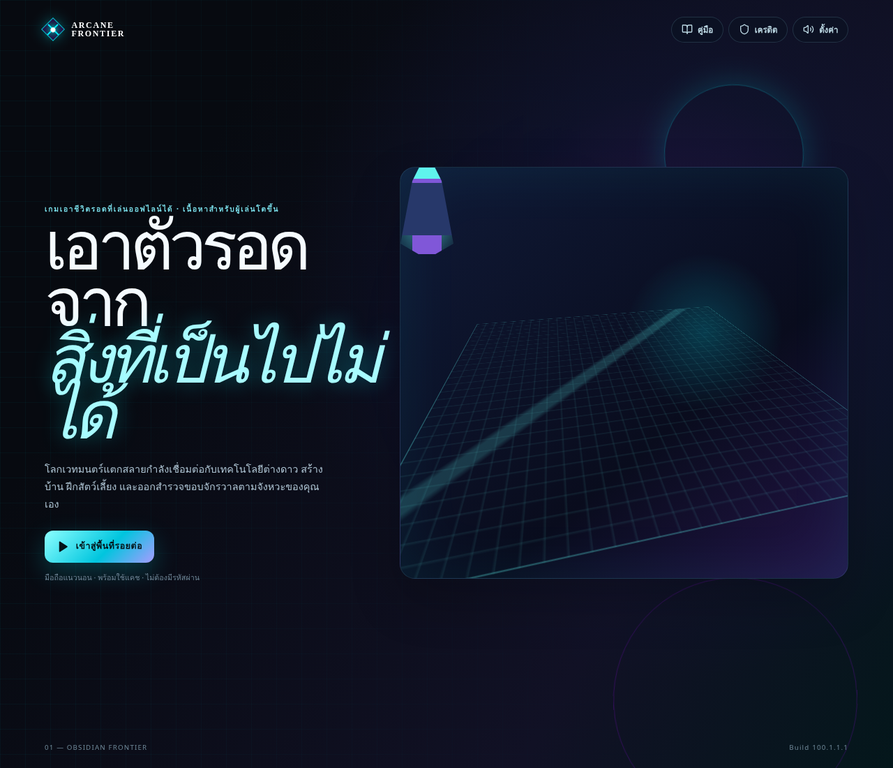
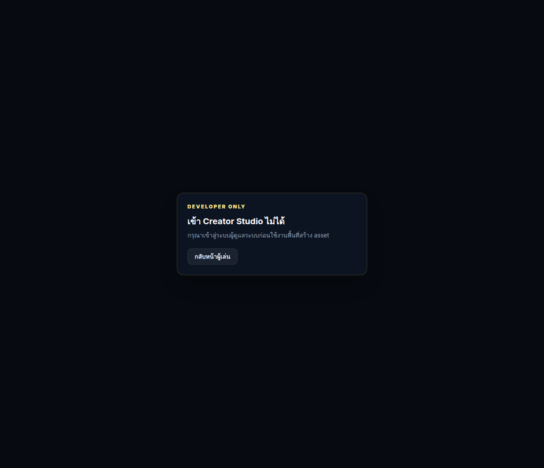

# Quest Gameplay-Event Browser Evidence — 2026-08-27

## ขอบเขต

เอกสารนี้บันทึก smoke test จาก dev server ของ `A_Survival` สำหรับ checkpoint แบบ read-only ที่เชื่อม MAP_001 quest progression กับ gameplay-event contract graph การตรวจนี้ยืนยันเฉพาะขอบเขต player/unauthenticated boundary ไม่ใช่ authenticated creator E2E และไม่ใช่หลักฐานว่า quest completion หรือ future-map unlock ทำงานจริง

| รายการ | หลักฐานที่ตรวจจริง |
|---|---|
| Repository | `/home/ubuntu/A_Survival` |
| Server | `http://127.0.0.1:3000/` จาก `pnpm dev -- --host 0.0.0.0` |
| Runtime map boundary | หน้า player แสดง `01 — OBSIDIAN FRONTIER` |
| Creator boundary | `/creator-workbench` แสดง `DEVELOPER ONLY` และปฏิเสธผู้ใช้ที่ยังไม่มี admin session |
| Authenticated creator test | ยังไม่ได้ตรวจ เพราะไม่มี authenticated OAuth session ในการทดสอบนี้ |
| Gameplay mutation | ไม่ได้กด action ใด และ preview graph ไม่ถูกเรียกจาก player route |

## หน้า player `/`

หน้าโหลดสำเร็จด้วย title `Arcane Frontier Survival` และแสดงแบรนด์/ข้อความสำหรับผู้เล่น ได้แก่ `ARCANE FRONTIER`, `คู่มือ`, `เครดิต`, `ตั้งค่า`, `เข้าสู่พื้นที่รอยต่อ`, `เกมเอาชีวิตรอดที่เล่นออฟไลน์ได้` และ `01 — OBSIDIAN FRONTIER` จาก DOM ที่ browser อ่านได้ ไม่พบข้อความ `Creator`, `Workbench`, `dependency graph` หรือ control สำหรับสร้าง content ในหน้า player นี้

ไฟล์ภาพหลักฐาน: [`evidence/quest-gameplay-event-player-2026-08-27.webp`](evidence/quest-gameplay-event-player-2026-08-27.webp)

## Unauthenticated Creator Workbench `/creator-workbench`

เส้นทางโหลดสำเร็จแต่ไม่แสดงเครื่องมือสร้าง โดยแสดงข้อความ `DEVELOPER ONLY`, `เข้า Creator Studio ไม่ได้` และ `กรุณาเข้าสู่ระบบผู้ดูแลระบบก่อนใช้งานพื้นที่สร้าง asset` พร้อมลิงก์ `กลับหน้าผู้เล่น` การตรวจนี้ยืนยันว่าเส้นทางไม่เปิด Workbench ให้ผู้ใช้ที่ไม่มี session และยืนยันได้เพียง unauthenticated boundary เท่านั้น

ไฟล์ภาพหลักฐาน: [`evidence/quest-gameplay-event-creator-unauthenticated-2026-08-27.webp`](evidence/quest-gameplay-event-creator-unauthenticated-2026-08-27.webp)

## ข้อจำกัดและคำแปลผล

การตรวจนี้ไม่ได้ยืนยัน role `gm`, `admin` หรือ `master` ผ่าน browser, ไม่ได้ยืนยันการเรียก `creator.dependencyGraph.questGameplayEventPreview` แบบ authenticated และไม่ได้ยืนยันฐานข้อมูลจริง, OAuth provider, Cache Storage, IndexedDB หรือ mobile acceptance จึงห้ามใช้เอกสารนี้อ้างว่า Creator Workbench เปิดใช้งานใน production หรือว่า quest/event bridge ถูกปิด blocker แล้ว

ผลที่ยืนยันได้คือ player landing ยังคงแยกจาก developer-only Workbench และ unauthenticated visitor ไม่สามารถเข้าเครื่องมือ Creator ได้ โดย checkpoint นี้ยังคงเป็น read-only preview และไม่สร้าง quest completion, gameplay event, cache, offline map state หรือ future-map unlock ใด ๆ
