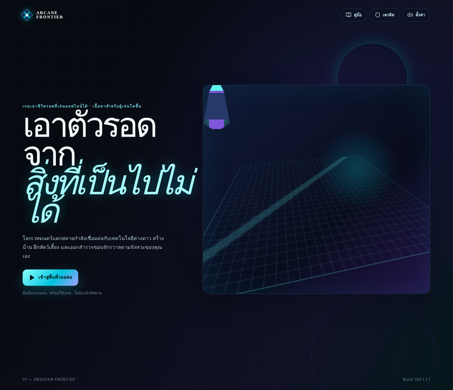

# Quest Reward → Inventory Browser Evidence — 2026-08-27

## ขอบเขต

หลักฐานนี้ตรวจเฉพาะ boundary ของหน้า player และเส้นทาง Creator Workbench แบบยังไม่ authenticated สำหรับ checkpoint `quest reward → inventory capacity`. ไม่ได้อ้าง authenticated creator E2E, การเรียก preview สำเร็จผ่าน browser, การแจก reward, การเขียน inventory หรือการปลดล็อก ability/map.

## ผลที่ตรวจจริง

| เส้นทาง | ผลที่เห็น | ข้อสรุปที่อ้างได้ |
|---|---|---|
| `http://127.0.0.1:3000/` | หน้า `Arcane Frontier` แสดงเฉพาะคู่มือ เครดิต ตั้งค่า ปุ่มเข้าสู่พื้นที่รอยต่อ และข้อมูล Obsidian Frontier; ไม่พบคำว่า creator, reward dispatch, inventory preview หรือ ability runtime | player landing ไม่ปะปนกับเครื่องมือ developer ใน smoke test นี้ |
| `http://127.0.0.1:3000/creator-workbench` | แสดง `DEVELOPER ONLY`, ข้อความให้เข้าสู่ระบบผู้ดูแลระบบก่อนใช้งานพื้นที่สร้าง asset และลิงก์กลับหน้าผู้เล่น | unauthenticated user ถูก gate ก่อนเห็น Workbench หรือเรียก preview mutation |

## ข้อจำกัดและการหยุดระบบ

dev server ชั่วคราวเริ่มที่ `127.0.0.1:3000` และถูกใช้เพื่อ boundary smoke เท่านั้น. ไม่มีการกรอกข้อมูลส่วนตัว ไม่มีการ submit mutation และไม่มีการทดสอบ authenticated creator. ภาพอ้างอิงที่ commit คู่กับเอกสารนี้คือ `docs/evidence/quest-reward-inventory-player-2026-08-27.webp` และ `docs/evidence/quest-reward-inventory-creator-unauthenticated-2026-08-27.webp`.

## หลักฐานภาพ

